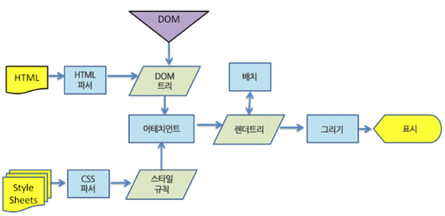

# 브라우저 동작 원리

* 자바스크립트가 가장 많이 사용되는 분야는 웹 브라우저 환경에서 동작하는 웹 페이지/애플리케이션입니다.  
* 대부분의 프로그래밍 언어는 운영체제(Operating System, OS) 위에서 실행되지만 웹 애플리케이션의 자바스크립트는 브라우저에서 HTML, CSS와 함께 실행됩니다.  

## 기본제공

* 브라우저는 HTML 요소를 선택하거나 조작하는 기능들의 집합인 DOM API를 기본적으로 제공합니다.  
* 서버 개발 환경을 제공하는 것이 주 목적인 Node.js는 클라이언트 사이드 Web API인 DOM API를 제공하지 않습니다.  
* Node.js에서는 파일을 생성하고 수정할 수 있는 File 시스템을 기본 제공합니다.  
* 브라우저는 이를 지원하지 않는습니다. (Web API인 File API FileReader 객체를 사용해 사용자가 지정한 파일을 읽어 들이는 것은 가능)

> 브라우저는 사용자 컴퓨터에서 동작한다. 만약 브라우저를 통해 사용자 컴퓨터에 파일을 생성하거나 기존 로컬 파일을 수정할 수 있다면 사용자 컴퓨터는 악성 코드에 노출되기 쉽기 때문에 보안 상 이유로 이를 금지하고 있다.

## [API](/etc/README.md#apiapplication-programming-interface) 지원

* 브라우저는 ECMAScript와 DOM, BOM, Canvas, XMLHttpRequest, Fetch, requestAnimationFrame, SVG, Web Storage, Web Component, Web worker와 같은 클라이언트 사이드 Web API를 지원합니다.  
*  Node.js는 클라이언트 사이드 Web API는 지원하지 않고 ECMAScript와 Node.js 고유의 API를 지원합니다.  

## 브라우저의 기능

* 브라우저의 핵심 기능은 사용자가 참조하고자 하는 웹페이지를 서버에 요청(Request)하고 서버의 응답(Response)을 받아 브라우저에 표시하는 것입니다.  
* 브라우저는 서버로부터 HTML, CSS, Javascript, 이미지 파일 등을 응답받습니다.   
* HTML, CSS 파일은 렌더링 엔진의 HTML 파서와 CSS 파서에 의해 파싱(Parsing)되어 DOM, CSSOM 트리로 변환되고 렌더 트리로 결합됩니다.  
* 이렇게 생성된 렌더 트리를 기반으로 브라우저는 웹페이지를 표시한다.  

위 그림은 웹킷 동작 과정입니다.

* HTML 파서는 script 태그를 만나면 자바스크립트 코드를 실행하기 위해 DOM 생성 프로세스를 중지하고 자바스크립트 엔진으로 제어 권한을 넘깁니다.  
* 제어 권한을 넘겨 받은 자바스크립트 엔진은 script 태그 내의 자바스크립트 코드 또는 script 태그의 src 어트리뷰트에 정의된 자바스크립트 파일을 로드하고 파싱하여 실행합니다.  
* 자바스크립트의 실행이 완료되면 다시 HTML 파서로 제어 권한을 넘겨서 브라우저가 중지했던 시점부터 DOM 생성을 재개합니다.

> body 요소의 가장 아래에 자바스크립트를 위치시키는 것은 좋은 아이디어 입니다. 그 이유는 아래와 같습니다.

    * HTML 요소들이 스크립트 로딩 지연으로 인해 렌더링에 지장 받는 일이 발생하지 않아 페이지 로딩 시간이 단축된다.
    * DOM이 완성되지 않은 상태에서 자바스크립트가 DOM을 조작한다면 에러가 발생한다.

## Reference

- [브라우저 동작 원리 - poiemaweb](https://poiemaweb.com/js-browser)
- [브라우저는 어떻게 동작하는가? - Hello world](https://d2.naver.com/helloworld/59361)

 **[⬆  Back to Top](#브라우저-동작-원리)**
---
