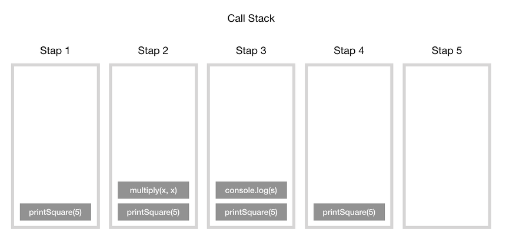
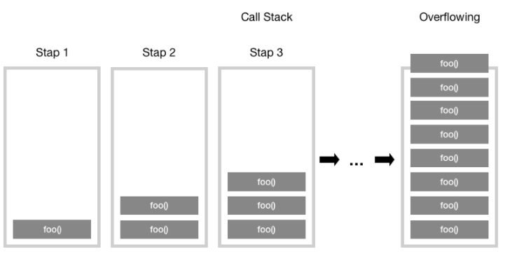
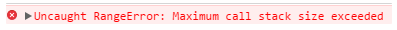
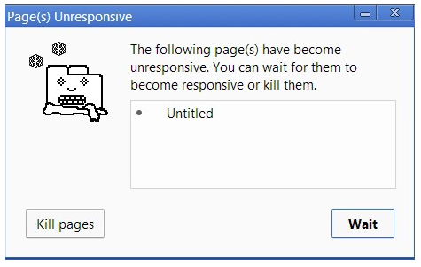

# 자바스크립트 동작 원리

* 모든 브라우저는 자바스크립트를 해석하고 실행할 수 있는 **자바스크립트 엔진**을 내장하고 있습니다.  
* 자바스크립트 엔진의 대표적인 예는 Google V8 엔진입니다. V8 엔진은 Chrome과 Node.js에서 사용합니다.  
* 기본적으로 브라우저에서 동작하는 코드는 Node.js 환경에서도 동작합니다. 

<p align="center"></p>

* 메모리 힙(Memory Heap) : 객체는 힙, 대부분 구조화되지 않은 메모리 영역에 할당되며, 변수와 객체에 대한 모든 메모리 할당은 여기서 발생한다.
* 호출 스택(Call Stack) : 코드 실행에 따라 호출 스택이 쌓인다.

## 실행 환경(Runtime)

<p align="center"></p>

* 사실 브라우저는 단순히 엔진 하나만으로 구성되어 있지 않습니다.  
* DOM, AJAX, setTimeout 등의 브라우저에서 제공하는 Web API라고 하는 것들이 있습니다.  
* 위와 같이 Web API의 호출을 통제하기 위한 Event Queue와 Event Loop도 존재합니다.


## 호출 스택(Call Stack)

* 자바스크립트는 기본적으로 싱글 [스레드](/etc/README.md#스레드thread) 기반 언어입니다.  
* 이는 호출 스택이 하나라는 의미로서, 한 번에 한 작업만 처리할 수 있습니다.
* **호출 스택**이란 기본적으로 우리가 **프로그램 상에서 어디에 있는지를 기록하는 자료구조**입니다.

<p align="center"></p>

* 동작 방식    
  - 함수를 실행하면 해당 함수의 기록을 스택 맨 위에 추가(Push) 합니다.
  - 우리가 함수를 결과 값을 반환하면 스택에 쌓여있던 함수는 제거(Pop) 됩니다.

## 스택 오버플로우(Stack overflow)

* 이름 그대로 스택의 사이즈를 초과 했을 때 발생하는 오류입니다.

```javascript
function foo() {
    foo();
}
foo();
```

<p align="center"></p>

<p align="center"></p>

* foo() 함수의 내부를 살펴보면 종료 조건 없이 자신을 계속해서 호출하게 됩니다.  
* 따라서 함수의 스택 프레임이 계속해서 호출 스택에 쌓이게 됩니다.
* 그러다가 어떠한 시점에서 호출 스택의 함수 호출 수가 호출 스택의 실제 크기를 초과하게 되고, 브라우저는 다음과 같은 오류를 발생시키는 것으로 함수를 종료 시킵니다.


## 단일 호출 스택의 문제점

* 단일 스레드를 사용하는 자바스크립트에서는 하나의 호출 스택만 있기 때문에, 브라우저가 호출 스택에서 많은 작업을 처리하기 시작하면 꽤 오랜 시간 동안 응답을 멈출 수 있습니다. 

<p align="center"></p>

* 가장 쉬운 해결책은 비동기 콜백(Asynchronous callbacks)을 사용하는 것입니다.
* 즉, 우리의 코드 일부를 실행하고 나중에 실행될 콜백(함수)를 제공합니다. 


## 이벤트 큐(Event Queue)와 비동기 콜백의 처리 과정

<p align="center"></p>

* 동작 방식  
  1. 우선 클릭과 같은 이벤트가 발생하면 DOM 이벤트, http 요청, setTimeout 등과 같은 비동기 함수는 C++로 구현된 web API를 호출하며, web API는 콜백 함수를 이벤트 큐(콜백 큐)에 밀어 넣습니다.  
  1. 이벤트 큐는 대기하다가 스택이 텅 비는 시점에 이벤트 루프를 돌리게 됩니다(스택에 넣음)  
  1. 이벤트 루프의 기본 역할은 큐와 스택, 두 부분을 지켜보다가 스택이 비는 시점에 콜백을 실행시켜 주며, 각 메시지와 콜백은 다른 메시지가 처리되기 전에 완전히 처리됩니다.


## Reference

- [자바스크립트 호출 스택(Call Stack) 이해하기](https://new93helloworld.tistory.com/358)
- [자바스크립트 호출 스택(Call Stack) 동작 예제](https://new93helloworld.tistory.com/361)
- [영상자료 - What the heck is the event loop anyway? | Philip Roberts | JSConf EU](https://youtu.be/8aGhZQkoFbQ)


 **[⬆  Back to Top](#자바스크립트-동작-원리)**
---
