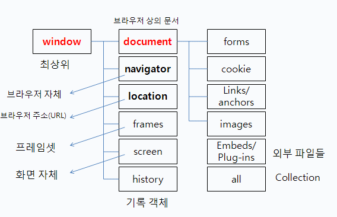
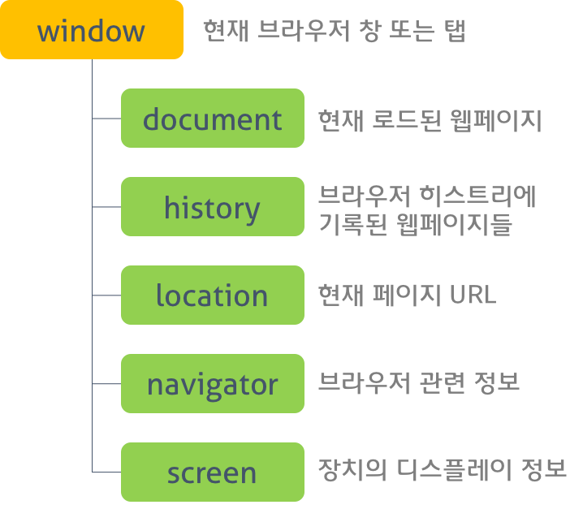

## 자바스크립트 객체의 분류

자바스크립트의 객체는 크게 3개의 객체로 분류할 수 있습니다.

1. [호스트 객체](#호스트-객체host-object)
1. [내장 객체](#내장-객체Native-object)
1. [사용자 정의 객체](#사용자-정의-객체user-defined-object)

### 호스트 객체(Host object)
> 브라우저에서 동작하는 환경의 호스트 객체는 전역 객체인 window, BOM(Browser Object Model)과 DOM(Document Object Model) 및 XMLHttpRequest 객체 등을 제공한다.  

* **전역 객체(Global Object)**
  전역 객체는 모든 객체의 유일한 최상위 객체를 의미하며 일반적으로 Browser-side에서는 window, Server-side(Node.js)에서는 global 객체를 의미한다.
  
  

* **BOM (Browser Object Model)** : 브라우저 객체 모델 (Browser Object Model)은 웹 브라우저와 관련된 객체의 집합을 나타낸다.  

  

* **DOM (Document Object Model)** : 문서 객체 모델은 현재 웹페이지의 모델을 생성한다.  

  

### 내장 객체(Native objects)
* 네이티브 객체(Native objects or Built-in objects or Global Objects)는 ECMAScript 명세에 정의된 객체를 말하며 애플리케이션 전역의 공통 기능을 제공한다.  
* 네이티브 객체는 애플리케이션의 환경과 관계없이 언제나 사용할 수 있다.

> Object, String, Number, Function, Array, RegExp, Date, Math와 같은 객체 생성에 관계가 있는 함수 객체와 메소드로 구성된다.

### 사용자 정의 객체(User-defined object)

* 자바스크립트에는 많은 객체들이 내장되어 있지만 보다 효율적인 작업을 위해 객체를 직접 정의해서 사용하기도 한다.  
* 사용자 정의객체는 생성자 함수(Constructor)와 new keyword를 이용하여 만든다.

### 참조

- [Window 객체 - Window | MDN](https://developer.mozilla.org/ko/docs/Web/API/Window)
- [표준 내장 객체 - JavaScript | MDN](https://developer.mozilla.org/ko/docs/Web/JavaScript/Reference/Global_Objects)
- [Window 객체와 BOM](https://www.zerocho.com/category/Javascript/post/573b321aa54b5e8427432946)
- [빌트인 객체](https://poiemaweb.com/js-built-in-object)

 **[⬆  Back to Top](#자바스크립트-객체의-분류)**
